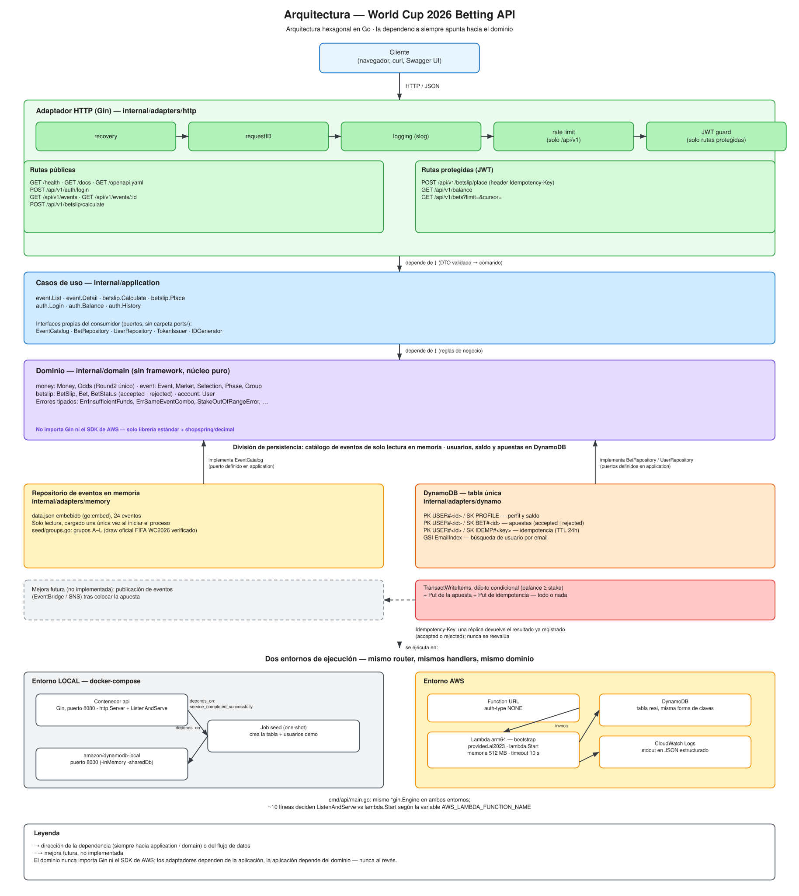
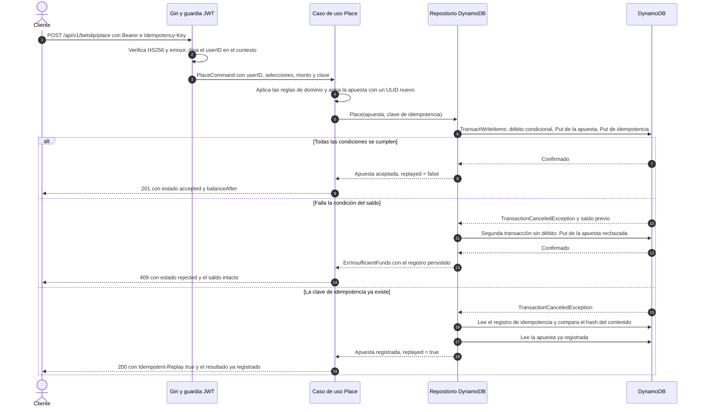
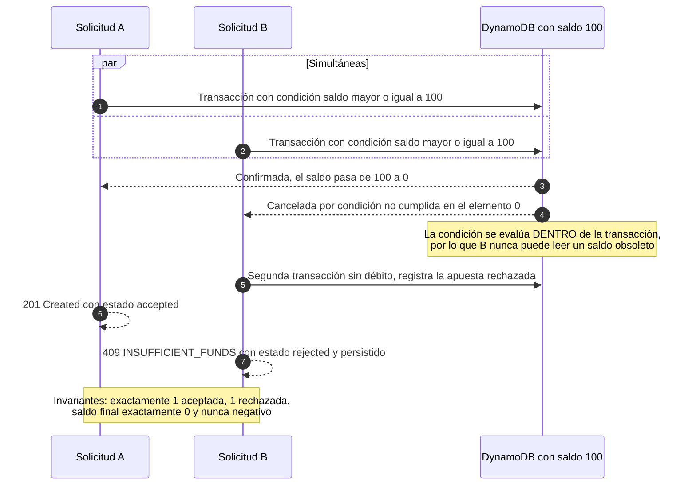

# API de Apuestas — Copa Mundial 2026

API REST en Go que expone el catálogo de eventos del Mundial 2026, calcula apuestas
simples y combinadas, y permite colocarlas descontando el saldo del usuario de forma
**segura ante concurrencia**. Arquitectura hexagonal, un único binario, desplegable en
AWS con coste de 0 USD al mes.

> **Nota de idioma**: la documentación de este repositorio (este README, los nueve ADR
> de `docs/adr/` y las descripciones de la especificación OpenAPI) está redactada en
> **español**, para que el equipo evaluador pueda revisar las decisiones de diseño con
> la mayor comodidad posible. El **código y todos los identificadores** —paquetes,
> tipos, rutas, campos JSON, variables de entorno y códigos de error— siguen la
> convención estándar de la industria en **inglés**. El criterio completo está en
> [ADR-0007](docs/adr/0007-idioma-de-la-documentacion.md).

---

## Índice

1. [Inicio rápido](#1-inicio-rápido)
2. [Endpoints y ejemplos con curl](#2-endpoints-y-ejemplos-con-curl)
3. [Variables de entorno](#3-variables-de-entorno)
4. [Arquitectura](#4-arquitectura)
5. [Decisiones de arquitectura (ADR)](#5-decisiones-de-arquitectura-adr)
6. [Concurrencia e idempotencia](#6-concurrencia-e-idempotencia)
7. [Emulación local de los servicios de nube](#7-emulación-local-de-los-servicios-de-nube)
8. [Despliegue en AWS y coste](#8-despliegue-en-aws-y-coste)
9. [Cómo se traslada esta demostración a EKS](#9-cómo-se-traslada-esta-demostración-a-eks)
10. [Mejora futura: publicación de eventos](#10-mejora-futura-publicación-de-eventos)
11. [Límites conocidos y procedencia de los datos](#11-límites-conocidos-y-procedencia-de-los-datos)
12. [Pruebas](#12-pruebas)
13. [Checklist de entrega](#13-checklist-de-entrega)

---

## 1. Inicio rápido

Un solo comando levanta todo el entorno: DynamoDB local, la carga inicial de datos y la
API.

```bash
docker compose up --build
```

Cuando el arranque termina, ya está disponible:

| Recurso | URL |
|---|---|
| Documentación interactiva (Swagger UI) | <http://localhost:8080/docs> |
| Especificación OpenAPI 3 | <http://localhost:8080/openapi.yaml> |
| Sonda de vida | <http://localhost:8080/health> |

**Credenciales de demostración** (creadas automáticamente, con un saldo inicial de
S/ 1000.00 cada una):

| Correo | Contraseña |
|---|---|
| `demo1@apuestatotal.com` | `Demo1234!` |
| `demo2@apuestatotal.com` | `Demo1234!` |

Verificación de extremo a extremo en un comando (login → cálculo → colocación → saldo):

```bash
scripts/smoke.sh http://localhost:8080
```

Para detener y limpiar el entorno:

```bash
docker compose down -v
```

**Requisitos**: únicamente Docker. La documentación interactiva viene embebida en el
binario, por lo que `/docs` funciona **sin conexión a internet**, sin depender de ningún
CDN.

---

## 2. Endpoints y ejemplos con curl

Todas las rutas de negocio cuelgan de `/api/v1`. `/health`, `/docs` y `/openapi.yaml`
están en la raíz y quedan fuera del límite de tasa.

| Método | Ruta | Autenticación | Descripción |
|---|---|---|---|
| `GET` | `/health` | — | Estado del servicio y versión |
| `GET` | `/docs` | — | Swagger UI embebido (funciona sin conexión) |
| `GET` | `/openapi.yaml` | — | Especificación OpenAPI 3.0.3 |
| `POST` | `/api/v1/auth/login` | — | Devuelve un JWT y su vigencia en segundos |
| `GET` | `/api/v1/events?from=&to=` | — | Lista de eventos por rango de fechas |
| `GET` | `/api/v1/events/{id}` | — | Detalle del evento con sus mercados ordenados |
| `POST` | `/api/v1/betslip/calculate` | — | Calcula simples y combinada sin colocar nada |
| `POST` | `/api/v1/betslip/place` | **JWT** | Coloca la apuesta y descuenta el saldo |
| `GET` | `/api/v1/balance` | **JWT** | Saldo actual del usuario autenticado |
| `GET` | `/api/v1/bets?limit=&cursor=` | **JWT** | Historial de apuestas del propio usuario |

### Secuencia completa, lista para copiar

Los identificadores usados a continuación existen en el conjunto de datos incluido, de
modo que los ejemplos funcionan tal cual.

**1. Autenticación**

```bash
curl -s -X POST http://localhost:8080/api/v1/auth/login \
  -H 'Content-Type: application/json' \
  -d '{"email":"demo1@apuestatotal.com","password":"Demo1234!"}'
```

```json
{ "token": "eyJhbGciOiJIUzI1NiIsInR5cCI6IkpXVCJ9...", "expiresIn": 3600 }
```

Para reutilizar el token en los pasos siguientes:

```bash
TOKEN=$(curl -s -X POST http://localhost:8080/api/v1/auth/login \
  -H 'Content-Type: application/json' \
  -d '{"email":"demo1@apuestatotal.com","password":"Demo1234!"}' \
  | grep -o '"token":"[^"]*"' | cut -d'"' -f4)
```

**2. Eventos por rango de fechas**

Ambos límites son opcionales y aceptan tanto `YYYY-MM-DD` como una marca temporal
RFC 3339 completa. Un valor de solo fecha en `to` incluye el día completo.

```bash
curl -s "http://localhost:8080/api/v1/events?from=2026-06-11&to=2026-06-13"
```

La respuesta es un **arreglo JSON directo**, sin envoltorio:

```json
[
  {
    "id": "784926067864698880",
    "name": "México vs Sudáfrica",
    "startsAt": "2026-06-11T19:00:00Z",
    "league": "Copa Mundial 2026",
    "home": "México",
    "away": "Sudáfrica",
    "phase": "group_stage",
    "group": "A",
    "isLive": false,
    "isSuspended": false
  }
]
```

**3. Detalle del evento**

```bash
curl -s http://localhost:8080/api/v1/events/784926067864698880
```

Los mercados se devuelven siempre en el mismo orden fijo —`ML0` (Resultado del partido
1X2), `OU200` (Total de goles), `QA158` (Ambos equipos anotan), `ML235` (Primer gol)—, y
las banderas de interfaz viajan en `settings`, a nivel de **evento**:

```json
{
  "id": "784926067864698880",
  "name": "México vs Sudáfrica",
  "phase": "group_stage",
  "group": "A",
  "settings": { "hasStatistics": true, "isBetBuilderEnabled": true },
  "markets": [
    {
      "id": "0ML784926076341366984",
      "marketType": { "id": "ML0" },
      "name": "Resultado del partido (1X2)",
      "selections": [
        { "id": "0ML784926076341366984D", "name": "Empate",    "odds": 4.34, "isDisabled": false },
        { "id": "0ML784926076341366984H", "name": "México",    "odds": 1.47, "isDisabled": false },
        { "id": "0ML784926076341366984A", "name": "Sudáfrica", "odds": 6.30, "isDisabled": false }
      ]
    }
  ]
}
```

**4. Cálculo de la apuesta (público, no coloca nada)**

Dos selecciones de **eventos distintos** producen las simples y la combinada:

```bash
curl -s -X POST http://localhost:8080/api/v1/betslip/calculate \
  -H 'Content-Type: application/json' \
  -d '{"selectionIds":["0ML784926076341366984D","0ML784926073862533120D"],"stake":100}'
```

```json
{
  "minStake": 1.00,
  "maxStake": 10000.00,
  "currency": "PEN",
  "stake": 100.00,
  "selections": [
    { "id": "0ML784926076341366984D", "eventId": "784926067864698880", "odds": 4.34 },
    { "id": "0ML784926073862533120D", "eventId": "784926067055177728", "odds": 3.58 }
  ],
  "singles": [
    { "selectionId": "0ML784926076341366984D", "odds": 4.34, "potentialReturns": 434.00 },
    { "selectionId": "0ML784926073862533120D", "odds": 3.58, "potentialReturns": 358.00 }
  ],
  "combo": {
    "selectionIds": ["0ML784926076341366984D", "0ML784926073862533120D"],
    "combinedOdds": 15.54,
    "potentialReturns": 1554.00
  }
}
```

Obsérvese el redondeo: `4.34 × 3.58 = 15.5372`, que redondeado da `combinedOdds = 15.54`;
el retorno se calcula sobre esa cuota ya redondeada, `100.00 × 15.54 = 1554.00`, de modo
que el importe mostrado siempre cuadra con la cuota mostrada
([ADR-0005](docs/adr/0005-dinero-y-cuotas-con-decimal.md)).

`minStake`, `maxStake` y `currency` se leen de la configuración en **cada** solicitud;
no son literales del handler.

**5. Regla de negocio: no se combinan dos selecciones del mismo evento**

```bash
curl -s -X POST http://localhost:8080/api/v1/betslip/calculate \
  -H 'Content-Type: application/json' \
  -d '{"selectionIds":["0ML784926076341366984H","0ML784926076341366984D"],"stake":50}'
```

```json
{
  "error": {
    "code": "SAME_EVENT_COMBO",
    "message": "La combinada no puede incluir dos selecciones del mismo evento.",
    "details": { "eventId": "784926067864698880" }
  },
  "requestId": "b28c0eee480b0be6"
}
```

HTTP `422 Unprocessable Entity`.

**6. Colocación de la apuesta (requiere JWT)**

La cabecera `Idempotency-Key` es **opcional**; enviarla activa la deduplicación.

```bash
curl -s -X POST http://localhost:8080/api/v1/betslip/place \
  -H 'Content-Type: application/json' \
  -H "Authorization: Bearer $TOKEN" \
  -H 'Idempotency-Key: demo-001' \
  -d '{"selectionIds":["0ML784926076341366984D","0ML784926073862533120D"],"stake":100}'
```

HTTP `201 Created`:

```json
{
  "betId": "01M0ZMGD66RME37MN44Z9Q3N5T",
  "type": "combo",
  "status": "accepted",
  "stake": 100.00,
  "combinedOdds": 15.54,
  "potentialReturns": 1554.00,
  "balanceAfter": 900.00,
  "createdAt": "2026-08-26T18:14:51.846286153Z",
  "selections": ["0ML784926076341366984D", "0ML784926073862533120D"]
}
```

**7. Réplica de la misma clave de idempotencia**

Repetir exactamente la misma solicitud con la misma `Idempotency-Key` devuelve HTTP
`200 OK` con la cabecera `Idempotent-Replay: true`, **el mismo `betId`** y **sin un
segundo débito**:

```bash
curl -s -D - -X POST http://localhost:8080/api/v1/betslip/place \
  -H 'Content-Type: application/json' \
  -H "Authorization: Bearer $TOKEN" \
  -H 'Idempotency-Key: demo-001' \
  -d '{"selectionIds":["0ML784926076341366984D","0ML784926073862533120D"],"stake":100}'
```

```text
HTTP/1.1 200 OK
Idempotent-Replay: true
```

El saldo permanece en `900.00` y `GET /api/v1/bets` sigue mostrando **una sola** apuesta.

**8. Saldo insuficiente**

```bash
curl -s -X POST http://localhost:8080/api/v1/betslip/place \
  -H 'Content-Type: application/json' \
  -H "Authorization: Bearer $TOKEN" \
  -H 'Idempotency-Key: demo-002' \
  -d '{"selectionIds":["0ML784926076341366984D"],"stake":5000}'
```

HTTP `409 Conflict`. El intento **queda registrado** con estado `rejected` y el saldo no
se modifica:

```json
{
  "error": {
    "code": "INSUFFICIENT_FUNDS",
    "message": "Saldo insuficiente para realizar la apuesta.",
    "details": {
      "betId": "01M0ZMGT1KVMA4PNMEN0H9FCJD",
      "status": "rejected",
      "rejectionReason": "insufficient_funds",
      "balance": 900.00,
      "required": 5000.00
    }
  },
  "requestId": "fd86c9f5c2f85a07"
}
```

**9. Saldo e historial**

```bash
curl -s http://localhost:8080/api/v1/balance -H "Authorization: Bearer $TOKEN"
curl -s http://localhost:8080/api/v1/bets    -H "Authorization: Bearer $TOKEN"
```

```json
{ "balance": 900.00, "currency": "PEN" }
```

```json
{
  "items": [
    {
      "betId": "01M0ZMGD66RME37MN44Z9Q3N5T",
      "type": "combo",
      "status": "accepted",
      "stake": 100.00,
      "combinedOdds": 15.54,
      "potentialReturns": 1554.00,
      "createdAt": "2026-08-26T18:14:51.846286153Z",
      "selections": ["0ML784926076341366984D", "0ML784926073862533120D"]
    }
  ],
  "nextCursor": null
}
```

El identificador del usuario procede **exclusivamente** del JWT verificado, nunca de un
parámetro de consulta: un cliente no puede pedir el historial de otra persona. El
historial incluye tanto las apuestas aceptadas como las rechazadas, porque un intento
rechazado es un registro de auditoría.

### Envoltorio de error: una sola forma para todos los fallos

Toda respuesta de error, sin excepción, tiene esta estructura:

```json
{
  "error": { "code": "...", "message": "...", "details": { } },
  "requestId": "b28c0eee480b0be6"
}
```

`code` es un valor estable pensado para que un cliente ramifique sobre él; `message` es
texto en español para una persona; `details` aparece solo cuando aporta contexto
accionable. El `requestId` también viaja en la cabecera `X-Request-Id` y se registra en
los logs, de modo que un fallo reportado por un usuario se puede localizar de inmediato.

| Código | HTTP | Cuándo se produce |
|---|---|---|
| `VALIDATION_ERROR` | 400 | Cuerpo, monto, `limit` o `Idempotency-Key` mal formados |
| `INVALID_DATE_RANGE` | 400 | `from` posterior a `to` |
| `UNAUTHORIZED` | 401 | Token ausente, inválido o expirado |
| `INVALID_CREDENTIALS` | 401 | Correo o contraseña incorrectos |
| `EVENT_NOT_FOUND` | 404 | El evento de la ruta no existe |
| `NOT_FOUND` | 404 | Ruta inexistente |
| `METHOD_NOT_ALLOWED` | 405 | Método no admitido en una ruta existente (incluye cabecera `Allow`) |
| `INSUFFICIENT_FUNDS` | 409 | Saldo insuficiente; la apuesta se registra como `rejected` |
| `IDEMPOTENCY_KEY_REUSED` | 409 | Clave reutilizada con un contenido distinto |
| `SAME_EVENT_COMBO` | 422 | Dos selecciones del mismo evento en una combinada |
| `STAKE_OUT_OF_RANGE` | 422 | Monto fuera de `[BETSLIP_MIN_STAKE_AMOUNT, BETSLIP_MAX_STAKE_AMOUNT]` |
| `DUPLICATE_SELECTION` | 422 | La misma selección repetida |
| `TOO_MANY_SELECTIONS` | 422 | Se superó `BETSLIP_MAX_SELECTIONS` |
| `SELECTION_NOT_FOUND` | 422 | Una selección del cuerpo no existe |
| `SELECTION_UNAVAILABLE` | 422 | La selección está deshabilitada |
| `RATE_LIMITED` | 429 | Se superó el límite por IP |
| `INTERNAL_ERROR` | 500 | Fallo inesperado (nunca expone el error interno) |
| `SERVICE_UNAVAILABLE` | 503 | Contención transitoria; nada se persistió ni se debitó, se puede reintentar |

Criterio aplicado de forma consistente: **404** para recursos referidos en la ruta,
**422** para recursos referidos en el cuerpo y para violaciones de reglas de negocio, y
**409** para conflictos de estado.

---

## 3. Variables de entorno

`config.Load()` valida todas las variables al arrancar y falla de inmediato con **un
único error agregado** que enumera todos los problemas a la vez, en lugar de uno por
ejecución. `.env.example` contiene el conjunto completo con valores válidos para
desarrollo local.

| Variable | Valor por defecto | En Lambda | Propósito |
|---|---|---|---|
| `PORT` | `8080` | se ignora | Puerto del servidor local |
| `APP_ENV` | `local` | `aws` | Etiqueta de entorno en los logs |
| `LOG_LEVEL` | `info` | `info` | Nivel de `log/slog` |
| `AWS_REGION` | `us-east-1` | proporcionada | Región del SDK |
| `DYNAMO_TABLE` | `apuesta-total` | igual | Nombre de la tabla |
| `DYNAMO_ENDPOINT` | *(sin valor por defecto)* | **vacía** | Endpoint alternativo para dynamodb-local. Vacía significa AWS real |
| `AWS_ACCESS_KEY_ID` | `local` | rol de IAM | dynamodb-local acepta cualquier credencial |
| `AWS_SECRET_ACCESS_KEY` | `local` | rol de IAM | ídem |
| `JWT_SECRET` | **ninguno** | requerida | Clave de firma HS256. **Sin valor por defecto: el arranque falla si está vacía** |
| `JWT_TTL` | `1h` | `1h` | Vigencia del token |
| `BETSLIP_MIN_STAKE_AMOUNT` | `1` | igual | Monto mínimo por apuesta |
| `BETSLIP_MAX_STAKE_AMOUNT` | `10000` | igual | Monto máximo por apuesta |
| `BETSLIP_CURRENCY_CODE` | `PEN` | igual | Moneda devuelta en las respuestas |
| `BETSLIP_MAX_SELECTIONS` | `20` | igual | Máximo de selecciones por apuesta |
| `RATE_LIMIT` | `60-M` | igual | Formato de `ulule/limiter`: 60 solicitudes por minuto y por IP |
| `IDEMPOTENCY_TTL` | `24h` | igual | Vigencia de los registros de idempotencia |
| `DEMO_ACCOUNT_INITIAL_BALANCE` | `1000` | `1000` | Saldo inicial de los usuarios de demostración |
| `SEED_RESET` | `false` | `false` | Si es `true`, sobrescribe los usuarios ya existentes |
| `AWS_LAMBDA_FUNCTION_NAME` | ausente | definida por AWS | **Solo lectura**: selecciona el modo Lambda |

Dos decisiones concretas de esta tabla:

- **`JWT_SECRET` no tiene valor por defecto.** Un valor de reserva firmaría tokens con
  una clave conocida sin que nadie se diera cuenta. El proceso prefiere no arrancar.
- **`DYNAMO_ENDPOINT` tampoco tiene valor por defecto**, pero por el motivo inverso: como
  la lectura de configuración interpreta una variable vacía como ausente, un valor por
  defecto no vacío haría imposible expresar "usar el AWS real", y en Lambda todas las
  llamadas apuntarían al nombre de host de docker-compose. Vacía significa AWS; el
  entorno local la define explícitamente.

El resumen de configuración que se registra al arrancar muestra todas las variables
**con `JWT_SECRET` reemplazado por `REDACTED`**.

---

## 4. Arquitectura



*Fuente editable: [`docs/diagrams/arquitectura.excalidraw`](docs/diagrams/arquitectura.excalidraw)*

### Regla de dependencias

```text
adapters  ──►  application  ──►  domain
   (HTTP, DynamoDB,   (casos de uso,     (reglas de negocio,
    memoria, JWT)      puertos)           sin framework)
```

La dependencia apunta **siempre hacia adentro** y nunca al revés:

- `internal/domain/` no importa nada más que la librería estándar y
  `shopspring/decimal`. Ni Gin, ni el SDK de AWS, ni nada de `adapters/`.
- `internal/application/` importa `domain` y **declara las interfaces que consume**
  (`EventCatalog`, `BetRepository`, `UserRepository`, `TokenIssuer`, `IDGenerator`).
- `internal/adapters/` importa `application` y `domain`, e implementa esas interfaces.

### Por qué no existe una carpeta `ports/`

En Go la interfaz la declara **quien la consume**, no quien la implementa ("accept
interfaces, return structs"). Cada puerto vive en el archivo `ports.go` del paquete de
aplicación que lo usa. La inversión de dependencias queda garantizada por la dirección
de los imports —comprobable de un vistazo sobre el árbol de paquetes— y no por el nombre
de una carpeta. Es una desviación deliberada respecto del diagrama hexagonal canónico,
motivada por el idioma del lenguaje ([ADR-0002](docs/adr/0002-division-de-la-persistencia.md)).

### Árbol de paquetes

```text
cmd/
  api/main.go          Raíz de composición; ramifica entre local y Lambda
  seed/main.go         Crea la tabla y siembra los usuarios de demostración
internal/
  domain/              money · event · betslip · account   (núcleo puro)
  application/         event · betslip · auth              (casos de uso + puertos)
  adapters/
    http/              router, middleware, handlers, DTO, envoltorio de error
    memory/            catálogo de eventos desde data.json embebido
    dynamo/            usuarios, saldo, apuestas, idempotencia
    security/          JWT HS256 y bcrypt
  platform/            config · logging (slog JSON) · id (ULID)
api/                   openapi.yaml + Swagger UI embebido (go:embed)
scripts/               deploy-aws.sh · destroy-aws.sh · smoke.sh
docs/adr/              Los nueve ADR
```

### Qué abstrae Gin y qué hay debajo

Gin está confinado a `internal/adapters/http/`
([ADR-0001](docs/adr/0001-framework-http-gin.md)). Para quien prefiera leer el código en
términos de la librería estándar, la equivalencia es directa:

| En Gin | En `net/http` |
|---|---|
| `*gin.Context` | El par `(http.ResponseWriter, *http.Request)`, más un mapa de valores por solicitud |
| `gin.HandlerFunc` | `http.HandlerFunc` con acceso al siguiente elemento de la cadena |
| `r.Use(mw)` y `c.Next()` | Composición manual de `http.Handler` que envuelve al siguiente |
| `r.Group("/api/v1")` | Un `ServeMux` anidado con su propia envoltura de middleware |
| `c.ShouldBindJSON(&dto)` | `json.NewDecoder(r.Body).Decode(&dto)` más validación explícita |
| `c.JSON(status, v)` | `w.Header().Set(...)`, `w.WriteHeader(status)`, `json.NewEncoder(w).Encode(v)` |

El orden de la cadena de middleware es el siguiente, del más externo al más interno:

```text
recovery → requestID → logging (slog) → bodyLimit (1 MiB)
        → rateLimit (solo /api/v1) → jwtAuth (solo rutas protegidas)
```

`recovery` va primero para que ningún pánico escape sin respuesta; `requestID` va
inmediatamente después para que **todo** envoltorio de error —incluido el de un pánico
recuperado— lleve su identificador.

### Observabilidad

Logs estructurados en JSON con `log/slog` hacia la salida estándar, que en local es la
salida del contenedor y en AWS es CloudWatch Logs, con el mismo formato. El middleware de
logging deriva un logger con ámbito de solicitud (`request_id`, `method`, `path`) y lo
guarda en el contexto, de modo que un caso de uso puede registrar eventos con
`logging.FromContext(ctx)` **sin importar nada del paquete HTTP**.

La colocación de una apuesta registra `user_id`, `bet_id`, `stake`, `status`,
`idempotency_key`, `replayed` y, si procede, `error_code`. El inicio de sesión registra
el correo y el resultado, **nunca** la contraseña ni su hash.

---

## 5. Decisiones de arquitectura (ADR)

Cada decisión relevante está documentada con el mismo formato: contexto, alternativas
evaluadas, decisión y consecuencias.

| ADR | Decisión | Resumen en una línea |
|---|---|---|
| [0001](docs/adr/0001-framework-http-gin.md) | Gin frente a chi y `net/http` | Alineación con el stack de destino, con el framework confinado a un adaptador |
| [0002](docs/adr/0002-division-de-la-persistencia.md) | División de la persistencia | Catálogo de solo lectura en memoria; estado mutable en DynamoDB |
| [0003](docs/adr/0003-debito-atomico-transactwriteitems.md) | Débito atómico con `TransactWriteItems` | Débito condicional y registro de la apuesta, todo o nada, en un solo viaje |
| [0004](docs/adr/0004-despliegue-lambda-function-url.md) | Lambda ZIP arm64 con Function URL | 0 USD/mes; EKS descartado por su coste de ≈ 73 USD/mes |
| [0005](docs/adr/0005-dinero-y-cuotas-con-decimal.md) | Dinero y cuotas con decimal exacto | Aritmética decimal y un único punto de redondeo en todo el código |
| [0006](docs/adr/0006-sin-cache-y-sin-colas.md) | Sin caché y sin colas | No resuelven ningún problema real aquí, y ElastiCache costaría 6× el presupuesto |
| [0007](docs/adr/0007-idioma-de-la-documentacion.md) | Idioma de la documentación | Prosa en español, identificadores en inglés |
| [0008](docs/adr/0008-semilla-de-fase-y-grupo.md) | Semilla de fase y grupo | Dato verificado del sorteo oficial, con camino de reserva que nunca falla |
| [0009](docs/adr/0009-publicacion-de-eventos-diferida.md) | Publicación de eventos diferida | EventBridge/SNS documentado como mejora futura, no implementado |

---

## 6. Concurrencia e idempotencia

Esta es la parte evaluada de forma explícita, y toda la corrección se concentra
deliberadamente en **una sola llamada**: `TransactWriteItems`.

### Colocación de una apuesta



### Dos colocaciones simultáneas cuando el saldo alcanza para una



### Por qué esta forma y no otra

**Un intento rechazado se persiste, pero nunca mueve dinero.** El reto pide persistir la
apuesta con un estado claro, y un intento fallido es además un registro de auditoría
valioso. La garantía no depende de la disciplina de quien programa: la segunda
transacción **no contiene ninguna actualización de saldo**, por lo que es
estructuralmente incapaz de debitar.

**Una réplica devuelve el resultado registrado; nunca reevalúa.** Una clave de
idempotencia responde a "¿mi solicitud llegó a procesarse?", de modo que la misma clave
debe dar siempre la misma respuesta. Si la primera vez el saldo era insuficiente, repetir
la clave devuelve ese mismo rechazo aunque el usuario haya recargado saldo entretanto.
Un reintento legítimo tras una recarga es una **solicitud nueva** y debe usar una **clave
nueva**, con la misma semántica que emplea Stripe.

**El orden de los elementos de la transacción es significativo**, porque DynamoDB
devuelve los motivos de cancelación en paralelo al índice de cada elemento. Un detalle
que apareció al implementarlo: en una réplica pueden fallar simultáneamente la condición
del saldo (índice 0) y la del registro de idempotencia (índice 2). El código comprueba el
índice 2 **primero e incondicionalmente**, de modo que una réplica siempre resuelve al
resultado ya registrado y nunca cae por accidente en el camino de "registrar un rechazo
nuevo".

### Cómo comprobarlo

```bash
# El emulador ya está expuesto en el puerto 8000 si el entorno de docker compose
# está levantado; en caso contrario, basta con arrancarlo suelto:
docker run -d -p 8000:8000 amazon/dynamodb-local

# Prueba real contra DynamoDB: 12 goroutines y un saldo que financia N-1 apuestas
go test ./internal/adapters/dynamo/ -run Concurrent -v
go test -race ./internal/adapters/dynamo/ -run Concurrent -v   # requiere cgo
```

Es importante ser preciso sobre **qué demuestra cada prueba**:

| Prueba | Qué demuestra realmente |
|---|---|
| `TestPlaceBet_ConcurrentDebits_NoOverdraftGivenAnAtomicPort` (capa de aplicación) | Que el caso de uso no introduce estado compartido ni condiciones de carrera **dado un puerto atómico**. El nombre lo dice de forma explícita: la atomicidad la aporta un doble de prueba protegido por un mutex, no la prueba |
| `TestPlaceAtomically_NConcurrentGoroutines_LeavesExactBalance` (integración) | **La prueba real**: 12 goroutines concurrentes contra `amazon/dynamodb-local`, con un saldo que financia exactamente N−1 apuestas. Verifica N−1 aceptadas, exactamente 1 rechazada, saldo final exacto, nunca negativo, y N apuestas almacenadas |

Las pruebas de integración se omiten cuando el emulador no está disponible, pero **jamás
en silencio**: imprimen un aviso destacado en la salida de error indicando que la
demostración de concurrencia **no se ejecutó** en esa ejecución. Un resultado global en
verde sin ese emulador no verifica este requisito, y la salida lo dice con todas las
letras.

---

## 7. Emulación local de los servicios de nube

El objetivo es que el entorno local ejerza **la misma semántica** que la nube, no una
aproximación.

| Servicio de AWS | Emulación local | Fidelidad |
|---|---|---|
| DynamoDB | `amazon/dynamodb-local` | Imagen oficial de AWS: misma API y semántica real de `ConditionExpression` y `TransactWriteItems`. Las pruebas de concurrencia se ejecutan contra ella |
| Lambda + Function URL | El mismo `*gin.Engine` servido por `http.Server` | El router, los middleware, los handlers y el dominio son idénticos byte a byte; solo cambia el transporte |
| Roles de IAM | Credenciales estáticas de prueba | dynamodb-local acepta cualquier credencial no vacía |
| CloudWatch Logs | Salida estándar del contenedor | Las mismas líneas JSON de `log/slog` |

**Cómo se conmuta entre ambos entornos**: `DYNAMO_ENDPOINT` sobrescribe el endpoint base
del SDK. Vacía significa AWS real; en docker-compose apunta a `http://dynamodb:8000`. El
código del repositorio es el mismo en ambos casos.

**Composición del entorno local**, con tres servicios encadenados:

```text
dynamodb (amazon/dynamodb-local, -inMemory -sharedDb)
   └─► seed (contenedor de un solo uso: crea la tabla, activa el TTL, siembra usuarios)
          └─► api  (arranca solo cuando seed termina con éxito)
```

Detalles que costaron una verificación y conviene dejar por escrito:

- **`-sharedDb` es obligatorio.** Sin esa opción, dynamodb-local particiona las tablas
  por cada combinación de credencial y región, y la API acabaría mirando un espacio de
  nombres vacío pese a que la carga inicial se ejecutó correctamente.
- **`-inMemory` en lugar de un volumen persistente.** Se verificó directamente que la
  configuración con `-dbPath` sobre un volumen nombrado falla de forma reproducible en
  este entorno (`SQLiteException: unable to open database file`), y que un `-dbPath`
  absoluto es rechazado por la propia imagen. `-inMemory` es exactamente lo que ya usan
  todas las pruebas de integración del repositorio. Coste asumido: los datos no
  sobreviven a `docker compose down`, lo cual es el compromiso correcto para un entorno
  de demostración que se recrea a demanda.
- **La carga inicial no usa `healthcheck`**, porque la imagen de dynamodb-local no
  incluye herramientas de shell. `cmd/seed` espera al endpoint con reintentos
  progresivos (hasta 60 segundos) y `api` depende de la finalización correcta de ese
  contenedor (`service_completed_successfully`).
- **Un único binario de siembra para local y para AWS.** `cmd/seed` crea la tabla si no
  existe, activa el TTL y siembra los usuarios de demostración de forma idempotente
  (`PutItem` con condición `attribute_not_exists`, de modo que reejecutarlo nunca
  destruye un saldo con el que ya se estaba probando). `SEED_RESET=true` fuerza la
  sobrescritura. Al usarse el mismo binario en ambos entornos, el esquema no puede
  divergir.

---

## 8. Despliegue en AWS y coste

### Comando

```bash
scripts/deploy-aws.sh
```

El script es **idempotente**: se puede reejecutar sin efectos secundarios, y en las
ejecuciones posteriores actualiza en lugar de recrear.

| Opción | Variable de entorno | Valor por defecto |
|---|---|---|
| `--function-name` | `FUNCTION_NAME` | `apuesta-total-api` |
| `--table-name` | `TABLE_NAME` | `apuesta-total` |
| `--role-name` | `ROLE_NAME` | `apuesta-total-lambda-role` |
| `--region` | `REGION` | La región configurada en la CLI de AWS, o `us-east-1` |
| `--memory` | `MEMORY_SIZE` | `512` (MB) |
| `--timeout` | `LAMBDA_TIMEOUT` | `10` (segundos) |
| `--help` | — | Muestra la ayuda completa |

**Requisitos**: AWS CLI v2 con credenciales resolubles, `go`, `curl` y `zip` (en Windows,
`powershell.exe` sirve como alternativa para generar el archivo).

### Qué crea

1. **Tabla de DynamoDB** con clave `PK`/`SK` y el índice global `EmailIndex`, en modo
   **aprovisionado** 10/10 RCU/WCU en la tabla y 5/5 en el índice (15/15 en total, dentro
   de la asignación permanente de 25/25). El modo bajo demanda se descarta de forma
   deliberada: no tiene capa gratuita.
2. **Rol de ejecución de IAM** con la política gestionada
   `AWSLambdaBasicExecutionRole` (solo CloudWatch Logs) más **una** política en línea
   acotada al ARN exacto de esta tabla y de su índice, con únicamente las acciones que el
   binario desplegado invoca en tiempo de ejecución: `GetItem`, `PutItem`, `UpdateItem`,
   `Query` y `TransactWriteItems`. Nunca `dynamodb:*` ni `Resource: "*"`.
3. **Función Lambda** (`provided.al2023`, arm64, handler `bootstrap`, compilada de forma
   cruzada desde `./cmd/api`) con su **Function URL** pública (`--auth-type NONE`).
4. **Retención de 7 días** en el grupo de logs de CloudWatch, para que los registros no
   se acumulen en silencio hasta rebasar la asignación gratuita.

Además ejecuta `cmd/seed` —el mismo binario ya probado del entorno local— contra la
tabla real, espera a que `GET /health` responda `200` en la URL desplegada (absorbiendo
el arranque en frío), valida el despliegue ejecutando `scripts/smoke.sh` contra esa misma
URL y, por último, imprime un resumen con la URL, los nombres de los recursos creados y
el comando exacto para eliminarlos.

### Eliminar todo lo creado

```bash
scripts/destroy-aws.sh --yes
```

Elimina la Function URL, la función Lambda, su grupo de logs, el rol de IAM (desvinculando
antes la política gestionada y borrando la política en línea) y la tabla de DynamoDB, de
modo que un despliegue de demostración no deja coste alguno detrás. La operación es
destructiva y **exige la bandera `--yes`**: sin ella, el script se limita a mostrar lo que
borraría y termina con código distinto de cero. Admite los mismos nombres de recurso que
`deploy-aws.sh` y tolera que un recurso ya no exista, por lo que también es seguro
reejecutarlo.

**Manejo de `JWT_SECRET`**: el secreto nunca se codifica en el repositorio. Si la variable
`JWT_SECRET` ya está definida al ejecutar el script, se usa tal cual. En caso contrario,
el script genera un secreto aleatorio robusto en la primera ejecución y lo guarda en
`.deploy/jwt-secret` (ruta ignorada por git, con permisos `600`), de modo que cada
reejecución reutiliza **el mismo** secreto: regenerarlo en cada despliegue invalidaría en
silencio todos los tokens emitidos anteriormente. En producción, ese valor procedería de
AWS SSM Parameter Store o de Secrets Manager.

**Sobre la Function URL con `--auth-type NONE`**: es una decisión consciente y no un
descuido. La autorización se aplica en la propia aplicación mediante JWT sobre **todas**
las rutas que modifican estado. Usar `AWS_IAM` obligaría a firmar cada solicitud con
SigV4 y haría imposible probar la API con `curl` o desde la interfaz de Swagger, que es
justo lo que se espera de esta entrega.

### Coste mensual

| Componente | Asignación siempre gratuita (permanente) | Coste |
|---|---|---|
| Lambda: invocaciones y cómputo (arm64) | 1 000 000 solicitudes + 400 000 GB-s al mes | 0 USD |
| Lambda Function URL | Sin cargo adicional sobre Lambda | 0 USD |
| DynamoDB (tabla + índice, aprovisionado) | 25 GB + 25 RCU + 25 WCU | 0 USD |
| CloudWatch Logs | 5 GB al mes entre ingesta, almacenamiento y consultas | 0 USD |
| Transferencia de datos saliente | 100 GB al mes | 0 USD |
| ECR | No se utiliza (despliegue por ZIP) | 0 USD |
| **Total** | | **0 USD/mes** (tope fijado: 5 USD) |

Estas asignaciones son **permanentes** e independientes de la antigüedad de la cuenta de
AWS: la reestructuración de la capa gratuita de julio de 2025 no las modificó. El
despliegue no crea VPC, NAT gateway, ElastiCache ni ningún otro recurso fuera de esa
asignación ([ADR-0006](docs/adr/0006-sin-cache-y-sin-colas.md)).

### Arranque en frío: comportamiento esperado, no un defecto

Tanto Lambda como una tabla con poco tráfico escalan a cero. La **primera** solicitud tras
un periodo de inactividad paga la inicialización del entorno de ejecución más la carga del
catálogo de eventos embebido; las solicitudes siguientes se sirven desde una instancia ya
caliente. Es el comportamiento normal de una arquitectura que escala a cero, y se asume a
propósito: mantener instancias aprovisionadas eliminaría la latencia inicial, pero también
el coste de 0 USD.

Para medirlo sobre el despliegue propio:

```bash
# Primera solicitud tras un periodo de inactividad (arranque en frío)
curl -s -o /dev/null -w 'tiempo total: %{time_total}s\n' https://<function-url>/health
# Inmediatamente después (instancia caliente)
curl -s -o /dev/null -w 'tiempo total: %{time_total}s\n' https://<function-url>/health
```

> **Cifra medida**: pendiente de registrar. Esta entrega no incluye un despliegue
> ejecutado con credenciales reales; el valor se anota aquí tras la primera ejecución de
> `scripts/deploy-aws.sh` (véase el [checklist de entrega](#13-checklist-de-entrega)).

---

## 9. Cómo se traslada esta demostración a EKS

EKS quedó descartado por una razón concreta y verificable: **solo el plano de control
cuesta 0,10 USD por hora, es decir, unos 73 USD al mes por clúster**, aproximadamente
quince veces el tope de presupuesto de este proyecto, y eso antes de sumar un solo nodo
de trabajo. La elección responde al presupuesto, no a un desconocimiento de la
plataforma de destino.

La buena noticia es que **el código no cambia**. La arquitectura hexagonal deja el
transporte fuera del núcleo, y la equivalencia es directa:

| En esta demostración | En un clúster de EKS |
|---|---|
| ZIP de Lambda sobre `provided.al2023` | La **imagen ya existente** del `Dockerfile` (`distroless/static-debian12:nonroot`), publicada en ECR |
| Function URL con `--auth-type NONE` | Un `Ingress` de ALB o un `Service` con un balanceador de red |
| `lambda.Start(ginadapter.NewV2(engine))` | La rama `http.ListenAndServe` que ya se usa en local: `AWS_LAMBDA_FUNCTION_NAME` simplemente no está definida |
| Rol de ejecución de Lambda | Una `ServiceAccount` con IRSA (o EKS Pod Identity) y **exactamente la misma política en línea** |
| Escalado automático de Lambda | `HorizontalPodAutoscaler` sobre la métrica de CPU o de solicitudes |
| `GET /health` | Sondas `livenessProbe` y `readinessProbe` apuntando a esa misma ruta |
| Variables de entorno de la función | `ConfigMap` para los valores no sensibles y `Secret` (o External Secrets con SSM) para `JWT_SECRET` |
| CloudWatch Logs desde la salida estándar | Fluent Bit o CloudWatch Container Insights leyendo la misma salida estándar en JSON |
| DynamoDB | **DynamoDB, sin ningún cambio**: es un servicio gestionado, ajeno al cómputo |

Lo único que habría que escribir de nuevo son manifiestos de Kubernetes (`Deployment`,
`Service`, `Ingress`, `HorizontalPodAutoscaler`, `ConfigMap`, `Secret`), no código de
aplicación. El `Dockerfile` de este repositorio ya produce la imagen que ese
`Deployment` ejecutaría.

Consecuencia práctica de mover el despliegue a EKS: la limitación de tasa dejaría de ser
por instancia y necesitaría un almacén compartido, exactamente el mismo compromiso que
se describe en la sección de límites.

---

## 10. Mejora futura: publicación de eventos

Una colocación aceptada interesa a más consumidores que quien realiza la solicitud:
notificaciones, analítica, detección de fraude y liquidación posterior al partido. El
patrón habitual en AWS es publicar un evento de dominio (`BetPlaced`) en **EventBridge**
o en **SNS**, con consumidores suscritos de forma independiente.

**No está implementado, y es una decisión, no un olvido.** No existe ningún consumidor
dentro del alcance, y una interfaz cuya única implementación no hace nada es código
muerto con apariencia de funcionalidad. La emulación local de EventBridge, además, es
débil: se estaría demostrando el emulador, no la integración.

**Punto de conexión exacto**: justo después de que `betslip.Place` obtenga una apuesta
almacenada con `status = accepted` y antes de devolver el resultado al handler. En ese
instante la transacción ya está confirmada, de modo que el evento describiría un hecho
consumado.

El cambio completo serían cuatro pasos: declarar el puerto `EventPublisher` en
`internal/application/betslip/ports.go`, añadir un adaptador
`internal/adapters/eventbridge/`, inyectarlo en `cmd/api/main.go` y añadir el permiso
`events:PutEvents` acotado al bus de destino en la política de IAM. Ni el dominio ni el
resto de los casos de uso se verían afectados.

**Semántica de fallo que exigiría**: la publicación **no puede** hacer fallar la
colocación. La apuesta ya está confirmada y el saldo ya está debitado; devolver un error
porque la difusión falló informaría de un fallo inexistente y provocaría un reintento
que, sin `Idempotency-Key`, colocaría una segunda apuesta. Es el mismo criterio que ya se
aplica hoy a la lectura del saldo posterior a la colocación, que se resuelve como
`balanceAfter: null` en lugar de convertir un error cosmético en un fallo de la
operación. Detalle completo en
[ADR-0009](docs/adr/0009-publicacion-de-eventos-diferida.md).

---

## 11. Límites conocidos y procedencia de los datos

Esta sección enumera lo que el sistema **no** hace y lo que se decidió sobre datos
imperfectos. Es información deliberadamente explícita.

### Procedencia del conjunto de datos

`internal/adapters/memory/seed/data.json` es el archivo entregado con el reto, sin
modificar: **24 eventos**, **191 mercados**, partidos del 11 al 24 de junio de 2026, liga
`Copa Mundial 2026`. Se movió desde `docs/` al paquete de siembra porque `go:embed` no
puede alcanzar archivos fuera del directorio de su propio paquete; los bytes son los
mismos.

### Fase y grupo: dato verificado, no supuesto

`data.json` **no contiene ninguna señal de fase ni de grupo**. El mapa de
`internal/adapters/memory/seed/groups.go` (39 nombres de equipo → letras A–L) se
transcribió del **sorteo final oficial de la Copa Mundial de la FIFA 2026, del 5 de
diciembre de 2025**, verificado de forma cruzada contra las capturas del enunciado y
contra los dos únicos agrupamientos de equipos que sí son derivables del propio dataset
(grupos C y G), que coinciden.

La resolución exige que **ambos** participantes de un evento coincidan en la misma letra.
Si un equipo no está en el mapa, si los dos discrepan o si la lista de participantes no se
puede interpretar, el resultado es `group` vacío —omitido de la respuesta JSON, nunca
enviado como `""`— con `phase: group_stage` y un aviso en el log de arranque. **El evento
se sigue sirviendo por completo: nunca se produce un pánico ni falla una solicitud.**

`TestGroupSeed_CoversEveryEvent` falla si cualquiera de los 24 eventos deja de resolver a
una letra, de modo que un cambio en la grafía de un equipo se convierte en un fallo
visible. Detalle completo en [ADR-0008](docs/adr/0008-semilla-de-fase-y-grupo.md).

### Calidad de los datos de origen: dos decisiones sobre datos imperfectos

**1. Cuotas por debajo del mínimo del dominio.** El dominio exige `Odds >= 1.01`. En el
archivo de origen hay **17 selecciones con `TrueOdds` por debajo de ese mínimo** (la
mayoría con valor `0`), y **las 17 tienen `IsDisabled: true`**: son marcadores de
selecciones cuya cuota nunca llegó a publicarse. De esas 17, **3 pertenecen a los cuatro
mercados que el servicio carga** (dos en el mercado `OU200` de *Brasil vs Marruecos* y
una en el `OU200` de *Bélgica vs Egipto*); las restantes están en tipos de mercado que se
descartan al cargar.

Decisión: una selección **deshabilitada** con una cuota inválida se ajusta al mínimo
(`1.01`) en lugar de hacer fallar el arranque completo, porque una selección deshabilitada
nunca puede llegar a valorarse —`BetSlip.Quote` la rechaza por `IsDisabled` antes de leer
siquiera su cuota—. Una selección **habilitada** con una cuota inválida sí es un defecto
real de datos y **sigue haciendo fallar la carga de forma ruidosa**. La alternativa
—rechazar el archivo entero por 17 marcadores que ningún cliente puede apostar— habría
impedido arrancar el servicio sin ganancia alguna.

**2. Un evento sin mercados.** El evento `803107802066452480` (*Bélgica vs Irán*) llega
con **cero mercados** en el archivo de origen. Se sirve tal cual, con `"markets": []`:

```bash
curl -s http://localhost:8080/api/v1/events/803107802066452480
```

Inventar mercados sería fabricar datos; ocultar el evento sería perder información
presente en la fuente. La respuesta refleja el dato real.

### Límites funcionales

| Límite | Detalle |
|---|---|
| **Sin liquidación de apuestas** | `BetStatus` tiene exactamente dos valores persistidos, `accepted` y `rejected`. Los estados `won`, `lost` y `void` son la extensión natural y quedan fuera del alcance |
| **Sin registro de usuarios** | Los usuarios de demostración se crean mediante la siembra. El reto pide un login sencillo, no un ciclo completo de gestión de cuentas |
| **Sin renovación de token** | El JWT vive una hora y no hay flujo de refresco |
| **Límite de tasa por instancia** | `ulule/limiter` usa un almacén en memoria. Con varias instancias de Lambda el límite efectivo se multiplica. Una solución global exigiría un almacén compartido, con el coste de infraestructura descrito en [ADR-0006](docs/adr/0006-sin-cache-y-sin-colas.md) |
| **Techo de capacidad aprovisionada** | 15/15 RCU/WCU dentro de la asignación gratuita. Una colocación aceptada consume 6 WCU y una rechazada unas 10, lo que sitúa el máximo sostenido en torno a 1–2 colocaciones por segundo. Es un límite de escala de demostración, no un defecto |
| **Idempotencia opcional** | La deduplicación solo actúa si el cliente envía `Idempotency-Key`. Sin esa cabecera, dos solicitudes idénticas son dos apuestas distintas, que es lo que la ausencia de la cabecera significa |
| **Catálogo en memoria por instancia** | Cambiar el catálogo requiere reconstruir y redesplegar. Con un proveedor de datos real, sería otro adaptador del mismo puerto |
| **Importes JSON como número** | Se eligió `"stake": 100.00` por legibilidad y por simetría con el formato del dataset. En producción, enviarlos como cadena evita que un cliente los parsee como `double` y pierda precisión |
| **Sin persistencia local** | dynamodb-local corre con `-inMemory`: los datos no sobreviven a `docker compose down`. En AWS la tabla es real y persistente |

---

## 12. Pruebas

**178 funciones de prueba en 42 archivos**, en cuatro niveles.

```bash
go test ./...              # Suite completa
go test -race ./...        # Con detector de condiciones de carrera
go test -short ./...       # Solo pruebas rápidas — NO requiere Docker
go test ./... -cover       # Con informe de cobertura
```

Los mismos comandos están disponibles como `make test`, `make test-race`,
`make test-short` y `make cover`.

> El detector de condiciones de carrera de Go se apoya en cgo, de modo que `-race`
> necesita un compilador de C en el `PATH` (`CGO_ENABLED=1`). En una máquina sin él,
> `go test ./...` sigue ejecutando exactamente las mismas pruebas, incluida la de
> concurrencia contra el emulador; lo único que no se activa es el detector.

Para ejecutar también las pruebas de integración hace falta el emulador:

```bash
docker run -d -p 8000:8000 amazon/dynamodb-local
go test -race ./internal/adapters/dynamo/...
```

### Qué demuestra cada nivel

| Nivel | Ubicación | Qué prueba realmente |
|---|---|---|
| Dominio | `internal/domain/` | Reglas de negocio puras: redondeo en los límites de medio céntimo (`1.005`, `2.675`, `152.495`), rechazo de combinada del mismo evento, límites del monto, cuota combinada como producto redondeado |
| Aplicación | `internal/application/` | Casos de uso contra dobles de prueba: resolución de selecciones, mapeo de errores, réplica idempotente y **ausencia de condiciones de carrera dado un puerto atómico** |
| Integración | `internal/adapters/dynamo/` | **La demostración real de concurrencia**: 12 goroutines contra `amazon/dynamodb-local`, con transacciones y condiciones auténticas |
| HTTP | `internal/adapters/http/` | Router real con `httptest`: guardia JWT, forma idéntica del envoltorio de error en todos los códigos, límite de tasa con clave `RemoteAddr` y nunca `X-Forwarded-For` |
| Humo | `scripts/smoke.sh` | Recorrido de extremo a extremo contra un servicio en ejecución, local o desplegado |

**`-short` funciona sin Docker.** Todas las pruebas de integración se omiten de forma
limpia cuando el emulador no está disponible, en lugar de fallar. Pero la omisión
**nunca es silenciosa**: se imprime un aviso destacado en la salida de error que indica
que la demostración de concurrencia real no se ejecutó, para que un resultado global en
verde no se confunda con un requisito verificado.

### Desarrollo guiado por pruebas

El proyecto se construyó con TDD estricto, y el historial de git lo demuestra: cada
commit `feat:` va precedido por su commit `test:`, que introduce la prueba en rojo. Se
puede comprobar directamente:

```bash
git log --oneline --reverse | head -30
```

```text
test(domain): add RED spec for Money/Odds rounding
feat(domain): add Money and Odds value objects
test(domain): add RED spec for Event/Group/Phase and User invariants
feat(domain): add Event/Market/Selection and Account types
test(domain): add RED spec for BetSlip.Quote
feat(domain): add BetSlip.Quote and the Bet aggregate
...
```

El historial contiene **25 commits `test:`**, cada uno con la prueba en rojo que precede
a su commit `feat:` correspondiente, alternándose en ese orden a lo largo de toda la
construcción. El comando siguiente lo muestra de un vistazo:

```bash
git log --oneline --reverse --format='%s' | grep -E '^(test|feat)' | head -20
```

---

## 13. Checklist de entrega

- [x] Repositorio público con el código completo
- [x] `docker compose up --build` levanta todo el entorno con un solo comando
- [x] README en español con inicio rápido, endpoints, variables de entorno y decisiones
- [x] Nueve ADR documentando cada decisión de arquitectura
- [x] Diagrama de arquitectura versionado, con su fuente editable
- [x] OpenAPI 3 y Swagger UI embebidos, funcionales sin conexión
- [x] Pruebas en cuatro niveles, incluida la demostración real de concurrencia
- [x] `scripts/deploy-aws.sh` idempotente, con política de IAM de privilegio mínimo, y
      `scripts/destroy-aws.sh` para eliminar todo sin dejar coste
- [ ] **Ejecutar `scripts/deploy-aws.sh`** con credenciales propias de AWS y confirmar
      que la prueba de humo pasa contra la URL desplegada (el propio script la ejecuta)
- [ ] **Anotar la cifra de arranque en frío medida** en la
      [sección 8](#8-despliegue-en-aws-y-coste)
- [ ] **Enviar el enlace del repositorio a `jimmy.sandoval@apuestatotal.com`**

Los tres últimos puntos requieren credenciales de AWS propias y una acción personal, por
lo que quedan fuera de lo automatizable en este repositorio.

---

## Licencia y alcance

Proyecto desarrollado como prueba técnica. El conjunto de datos de eventos procede del
material de referencia entregado con el reto. El material interno de proceso y las notas
personales están excluidos del repositorio mediante `.gitignore`: la entrega contiene el
producto y sus decisiones.
